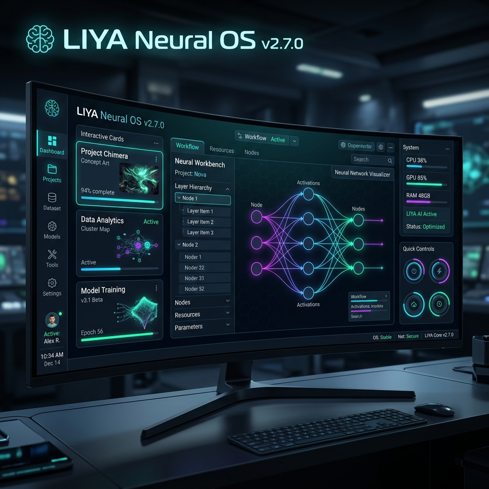
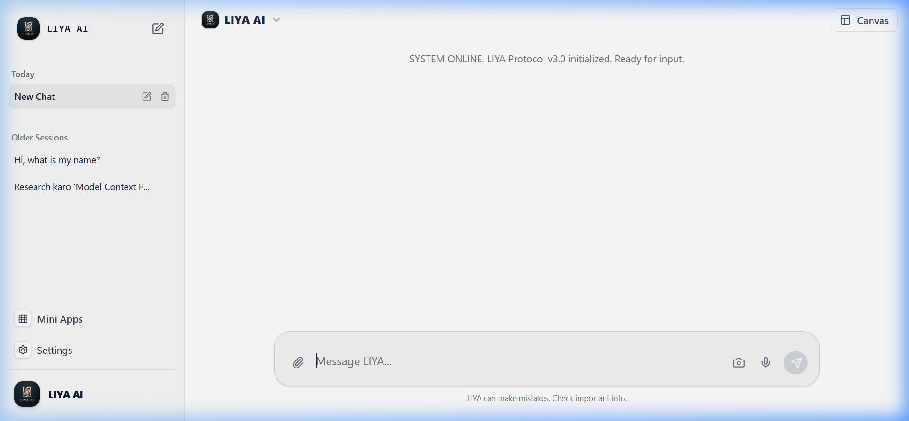
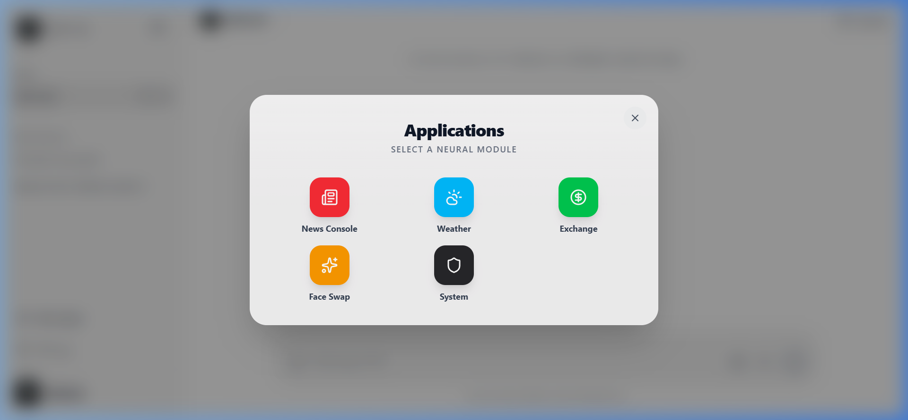
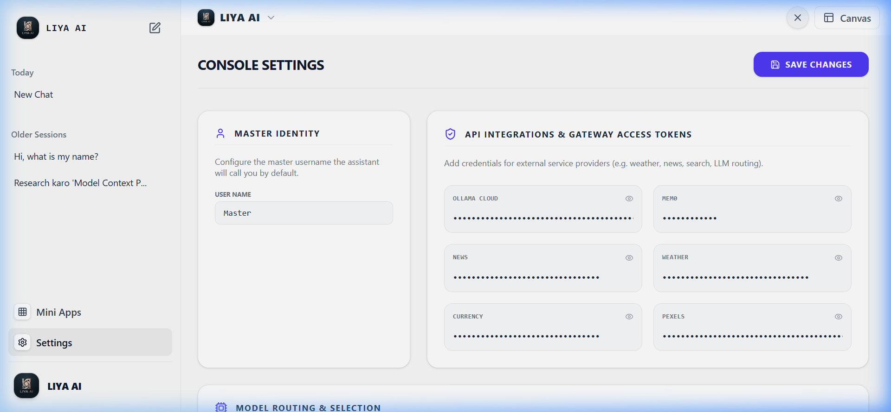

# 🌌 LIYA: Neural OS v2.7.0 (Agentic Desktop Workstation)



> **LIYA (Neural Intelligent Yield Assistant)** is a premium, autonomous, local-first AI workstation, digital companion, and multi-agent command center. Built with a futuristic dark-mode sci-fi HUD aesthetic, LIYA empowers users with real-time web research, stealth Playwright scraping, sandboxed terminal automation, high-speed face swapping, Mem0 long-term vector memory, interactive Canvas application rendering, and an integrated suite of built-in Mini Apps.

---

### ✨ Key System Highlights
- 🧠 **Mem0 Long-Term Vector Memory**: Cloud + Local memory sync for context-aware, personalized AI conversations.
- 🎨 **Interactive Visual Canvas**: Live execution of React/HTML/JS web apps, particle animations, Recharts, maps, and YouTube music.
- 🎭 **High-Speed Computer Vision**: Millisecond image & multi-threaded video face swapping (`inswapper_128.onnx`).
- 🧩 **Built-in Mini Apps Suite**: Integrated Weather, News, Currency, System Telemetry, Scheduler, and Vision Scanner apps.
- 🗣️ **Ultra-Fast Indian Accent TTS**: Real-time Hindi & Indian English neural speech synthesis (`hi-IN-SwaraNeural`).
- 🕵️ **Stealth Browser & Deep Research**: Playwright stealth web crawler, single-link deep ingestion, and Google/Pexels image scraper.
- 🤖 **Multi-Agent Orchestrator**: Subagent task delegation (`researcher`, `coder`, `executor`, `security_guard`) via a shared Blackboard.

---

## 📸 Interface Screenshots & Visual Gallery

| Main Desktop HUD | Mini Apps Suite Launcher |
| :---: | :---: |
|  |  |
| *Sci-Fi HUD Console & Interactive Canvas* | *Integrated Mini Apps Ecosystem* |

| Console Settings & API Gateway |
| :---: |
|  |
| *API Keys & Model Routing Console* |

---

## ⚙️ How It Works (System Architecture & Working Model)

LIYA functions as a distributed agentic desktop system divided into three main layers:

```
+-------------------------------------------------------------+
|                     REACT 19 FRONTEND                       |
|   [JarvisHUD]   [Interactive Canvas]  [Mini Apps Suite]     |
|   [Mem0 Engine] [Voice Engine]        [Camera Vision]       |
+------------------------------+------------------------------+
                               | WebSockets / REST API
+------------------------------v------------------------------+
|                     EXPRESS BACKEND SERVER                  |
|  - server.js (Main Controller & REST Endpoints)             |
|  - orchestrator.js (Routing & JSON Repair)                  |
|  - scheduler.js (node-cron Automations)                     |
|  - voiceEngine.js (Ultra-Fast Indian TTS Engine)            |
|  - mcpManager.js (Universal Tools Engine)                   |
+-----+-------------------+-------------------+---------------+
      |                   |                   |
      | OS Commands       | Media Processing  | API Calls / Cloud
+-----v---------+   +-----v-----------+   +---v---------------+
| LOCAL SYSTEM  |   | ONNX PIPELINE   |   | OLLAMA CLOUD /    |
| Filesystem    |   | FaceSwap/Video  |   | MEM0 CLOUD MEMORY |
| CMD / Terminal|   | facedetect.py   |   | https://mem0.ai   |
+---------------+   +-----------------+   +-------------------+
```

---

## 🧠 1. Mem0 Long-Term Memory Integration

LIYA features a state-of-the-art **Mem0 Vector Memory Architecture** designed to remember facts, user preferences, past interactions, and context across sessions:

- **Mem0 Cloud + Local Storage Fallback**: When `VITE_MEM0_API_KEY` is configured in Settings, LIYA syncs memories directly with **Mem0 Cloud API (`https://api.mem0.ai/v1`)**. If offline or unconfigured, it seamlessly falls back to local memory storage (`localStorage`).
- **Automatic Conversation Ingestion**: Every user query and AI response is automatically ingested into Mem0 memory after execution without blocking the UI thread.
- **Intelligent Contextual Search**: Before responding to complex queries, LIYA searches Mem0 memory and injects relevant past facts directly into the LLM system prompt context.
- **Memory Management in Settings**: Easily input and update your `VITE_MEM0_API_KEY` right inside LIYA Console Settings (`SettingsControl.jsx`).

---

## 🎨 2. Interactive Canvas (Visual Workstation Canvas)

LIYA includes a dedicated **Interactive Canvas** (`Canvas.jsx`) for live visual application execution, media rendering, and data visualization:

- **Live Code Execution**: When LIYA generates HTML/CSS/JS code, web pages, particle animations, or interactive tools, they render live inside the Canvas preview frame.
- **Interactive Widgets**:
  - **ChartRenderer**: Dynamic interactive charts powered by Recharts (line charts, bar graphs, pie charts).
  - **MapRenderer**: Interactive geographical maps and location markers powered by Leaflet.
  - **DiffViewer**: Code diff comparison tool for reviewing code changes.
  - **YouTube Music Buddy**: Search, stream, and play YouTube audio/video directly on the Canvas.
  - **News & Search Cards**: Displays rich news feeds and image search results.
- **Blackboard Synchronization**: Multi-agent state and subagent outputs sync directly to the shared Blackboard and render onto the Canvas.

---

## 🧩 3. Built-in Mini Apps Suite

LIYA comes with a built-in suite of specialized **Mini Apps** accessible directly from the App Launcher modal (`AppLauncherModal.jsx`):

1. **🎭 Face Swap & Video Swap**:
   - **High-Speed Image Swap**: Swaps faces on target photos in milliseconds using optimized ONNX `buffalo_l` models.
   - **Multi-Threaded Video Swap**: High-speed parallel video frame processing with `ThreadPoolExecutor` and FFmpeg ultrafast encoding.
   - **Crop & History Manager**: Manage reference face crops and clean swap history with one click.
2. **⛅ Weather Workstation** (`WeatherControl.jsx`): Live weather telemetry, temperature forecasts, humidity, and atmospheric data for global cities.
3. **📰 News Intelligence Center** (`NewsControl.jsx`): Real-time global headlines, Google News RSS, Indian news feeds, and community reactions summarized in Hinglish.
4. **💱 Currency Converter** (`CurrencyControl.jsx`): Real-time exchange rate engine supporting global currencies (USD, INR, EUR, GBP, JPY, CAD, etc.).
5. **📊 System Metrics Monitor** (`SystemControl.jsx`): Real-time dashboard monitoring CPU usage, memory consumption, disk space, and active node server health.
6. **⏰ Task & Automation Scheduler** (`TaskControl.jsx`): User-friendly cron job scheduler and reminder manager for background tasks.
7. **📷 Camera Vision Scanner** (`CameraCapture.jsx`): Live webcam snapshot capture for multimodal visual analysis.
8. **⚙️ Console Settings** (`SettingsControl.jsx`): Manage Master Identity, API tokens (Mem0, Ollama Cloud, Weather, News, Pexels, Currency), and LLM model routing.

---

## 🗣️ 4. Ultra-Fast Indian Accent TTS Engine

- **Native Voice Engine** (`voiceEngine.js`): Uses Microsoft Edge Neural TTS (`hi-IN-SwaraNeural`) to synthesize hyper-realistic Hindi and Indian-English speech in real-time.
- **Fallback Protection**: Automatically falls back to Web Speech API (`speakBrowser`) if offline.

---

## 🚀 5. Advanced Web Scraper & Multimodal Search

- **Playwright Stealth Scraper**: Crawls JS-heavy websites bypassing bot detectors and Cloudflare.
- **Single Link Ingestion**: Give LIYA a single URL and it extracts, cleans, and analyzes full detailed page content.
- **Google Images & Pexels Scraper**: Fetches high-resolution images directly for chat and canvas display.
- **CORS Image Proxy**: `/api/proxy/image` endpoint proxies external image CDN URLs safely.

---

## 💎 6. Ultra-Premium Classic Logo & Branding

- **Custom Luxury Emblem**: Includes LIYA's signature silver-platinum & rose-gold monogram logo emblem (`public/liya_logo.png`).
- **Custom Favicon & Page Title**: Customized branding across header, sidebar, and browser tab.

---

## 🤖 AI Agents & Personas

LIYA has a built-in agent ecosystem designed to coordinate, write code, run research, and secure system actions:

1. **🧠 Multi-Agent Orchestrator**: Breaks complex prompts into subtasks, spawns background subagents (`spawn`), and consolidates outputs onto the Blackboard.
2. **🛡️ Agent Security Guard**: Sanitizes inputs and guards against prompt injections and malicious payloads.
3. **📝 Academic Researcher Subagent**: Conducts deep multi-source research with automatic source citation.
4. **💻 Fast Coder Subagent**: Generates complete web applications, interactive scripts, and components.
5. **⚡ Terminal Executor Subagent**: Executes sandboxed shell commands, installs packages, and inspects build logs.
6. **📰 News Intelligence Agent**: Pulls live trending topics, RSS feeds, and Hinglish summaries.

---

## 🛠️ Complete Installation & Setup Guide

Follow this detailed step-by-step guide to install and configure LIYA on any local machine (Windows / macOS / Linux):

---

### 📋 Phase 1: System Prerequisites Check

> [!IMPORTANT]
> Ensure the following global tools are installed on your operating system before proceeding:

| Tool | Recommended Version | Download Link | Verification Command |
| :--- | :--- | :--- | :--- |
| **🟢 Node.js** | `v18.x` or `v20+` | [nodejs.org](https://nodejs.org/) | `node -v` & `npm -v` |
| **🐍 Python** | `v3.10+` / `v3.11` / `v3.13` | [python.org](https://www.python.org/) | `python --version` & `pip --version` |
| **🎬 FFmpeg** | Latest (added to PATH) | [ffmpeg.org](https://ffmpeg.org/) | `ffmpeg -version` |
| **🐙 Git** | Latest | [git-scm.com](https://git-scm.com/) | `git --version` |

---

### 📦 Phase 2: Repository & Dependency Setup

#### Step 1: Clone Repository
Open your terminal and clone the LIYA repository:
```bash
git clone https://github.com/hackertech142/Liya-adavnce-ai-asistant.git
cd Liya-adavnce-ai-asistant
```

#### Step 2: Environment Configuration
Copy the template `.env.example` file to create your local `.env`:
```bash
# Windows PowerShell / Linux / macOS
cp .env.example .env
```

> [!TIP]
> **API Key Setup Options**:
> - **Method A (Web UI - Recommended)**: Launch LIYA and configure all API keys (`VITE_OLLAMA_CLOUD_API_KEY`, `VITE_MEM0_API_KEY`, Weather, News, Pexels, Currency) directly inside **Console Settings** (`SettingsControl.jsx`). Changes sync dynamically without restarting.
> - **Method B (Manual `.env`)**: Open `.env` in any text editor and add your keys:
>   ```env
>   VITE_OLLAMA_CLOUD_API_KEY=your_ollama_cloud_key
>   VITE_MEM0_API_KEY=your_mem0_cloud_key
>   VITE_USER_NAME=Navraj
>   ```

#### Step 3: Install Node.js Dependencies
Install packages for both the React 19 Frontend Workstation and the Express Backend Server:
```bash
# 1. Install root frontend dependencies
npm install

# 2. Install backend Express server dependencies
npm install --prefix backend
```

#### Step 4: Install Python ML Libraries (FaceSwap Pipeline)
Install required computer vision, PyTorch/ONNX, and image processing libraries:
```bash
pip install -r backend/bin/requirements.txt
```

#### Step 5: Setup Playwright Stealth Browsers
Install Playwright Chromium browser binaries for background web crawling and screenshot scraping:
```bash
npx playwright install chromium --with-deps
```

#### Step 6: Verify FaceSwap ONNX Model
Ensure `inswapper_128.onnx` model is present inside `backend/bin/`:
- If missing, download `inswapper_128.onnx` and place it at `backend/bin/inswapper_128.onnx`.

---

### ⚡ Phase 3: Launching LIYA Workstation

#### Method 1: 1-Click Windows Launcher (Recommended)
Simply double-click **`Start_LIYA_AI.bat`** in the root directory:
```text
Double-click: Start_LIYA_AI.bat
```
*It automatically spins up the Express Backend Server, starts the Vite React Frontend Workstation, and opens `http://localhost:5173` in your default browser.*

#### Method 2: Manual Terminal Startup
Run the unified npm startup command from the root directory:
```bash
npm start
```

| Service Layer | Local URL | Port |
| :--- | :--- | :--- |
| **🖥️ React 19 Frontend Workstation** | [http://localhost:5173](http://localhost:5173) | `5173` |
| **⚙️ Express Backend Control Engine** | [http://localhost:3000](http://localhost:3000) | `3000` |

---

### 🔧 Troubleshooting & Tips

- **Port in Use Error**: If port `3000` or `5173` is busy, kill existing node processes using `taskkill /F /IM node.exe` (Windows) or `pkill -f node` (Linux/macOS).
- **FFmpeg Not Found**: Ensure `ffmpeg` is added to your OS Environment Variables PATH so `videoswap.py` can render output audio tracks.
- **Mem0 Cloud Connection**: If `VITE_MEM0_API_KEY` is not provided, LIYA gracefully operates in **Local Memory Fallback Mode** (`localStorage`).

---

*Developed with ❤️ for Navraj Singh | LIYA Neural OS v2.7.0*

